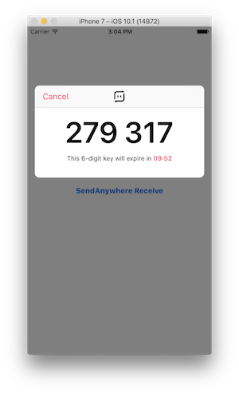
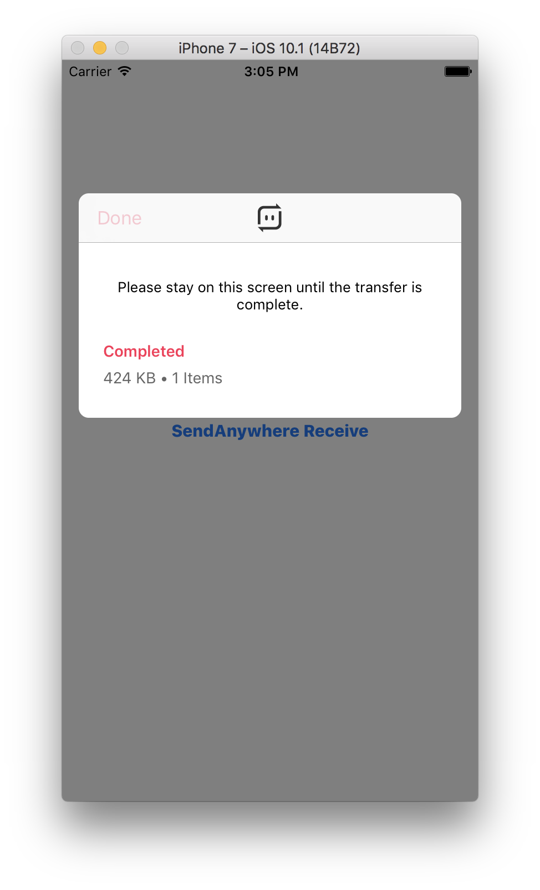
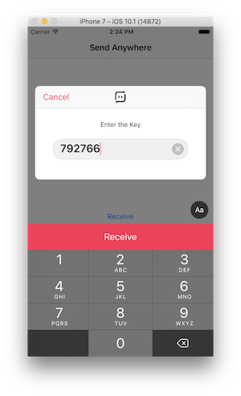
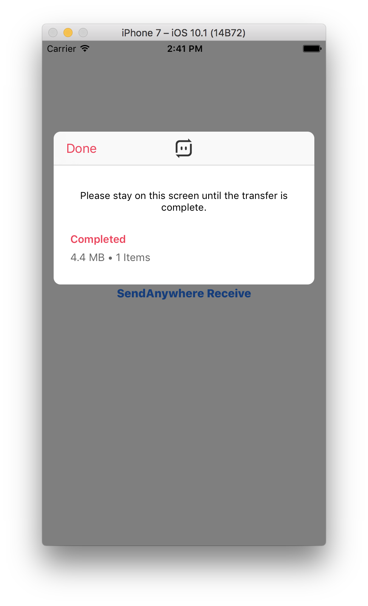

<p align="center" >
  
</p>


[](http://cocoapods.org/pods/SendAnywhereSDK)
[](http://cocoapods.org/pods/SendAnywhereSDK)
[](http://cocoapods.org/pods/SendAnywhereSDK)
[](http://twitter.com/send_anywhere)
[](https://www.facebook.com/Send2Anywhere)

The simplest way to Send files Anywhere

## Prequisites
Please issue your API key from following link first:
https://send-anywhere.com/web/page/api


### Installation with CocoaPods

[CocoaPods](http://cocoapods.org) is a dependency manager for Objective-C, which automates and simplifies the process of using 3rd-party libraries like SendAnywhereSDK in your projects. You can install it with the following command:

```bash
$ gem install cocoapods
```

#### Podfile

To integrate SendAnywhereSDK into your Xcode project using CocoaPods, specify it in your `Podfile`:

```ruby
source 'https://github.com/CocoaPods/Specs.git'
platform :ios, '8.0'

target 'TargetName' do
pod 'SendAnywhereSDK'
end
```

Then, run the following command:

```bash
$ pod install
```

## Requirements

| Minimum iOS Target  | iOS 8 |
|:--------------------:|:-----:|

## Troubleshooting
If you have any problem or questions with Send Anywhere iOS SDK, please create new issue(https://github.com/estmob/SendAnywhere-iOS-UI-SDK/issues) or contact to our customer center(https://send-anywhere.zendesk.com).

## Usage
First look at the source code of [the provided demo](https://github.com/dustmob/SendAnywhereSDK/tree/master/Example).

#### Initialization

```swift
func application(_ application: UIApplication, didFinishLaunchingWithOptions launchOptions: [UIApplicationLaunchOptionsKey: Any]?) -> Bool {
        SendAnywhere.withKey("INPUT_YOUR_API_KEY")
        return true
}
```

#### Show a Send file UI.

```swift
do {
    let viewController = try sa_showSendView(withFiles: [fileURL])
} catch let error {

}
```




#### Show a Receive file UI.

```swift
do {
    let viewController = try sa_showReceiveView()
} catch let error {

}
```




#### If you want to download file of specific type.

```swift
// If you want to download files of document type.
SendAnywhere.sharedInstance().downloadFileFilter = [.document]

// If you want to download files of image type.
SendAnywhere.sharedInstance().downloadFileFilter = [.image]

// If you want to download files of audio type.
SendAnywhere.sharedInstance().downloadFileFilter = [.audio]

// If you want to download files of media type.
SendAnywhere.sharedInstance().downloadFileFilter = [.image, .video, .audio]

// If you want to download files of custom file pattern.
SendAnywhere.sharedInstance().customFilePattern = "((.+)(\\.(?i)(jpg|jpeg|png|gif))$)"
```

#### Send files without UI.

```swift
if let fileInfo = SAFileInfo(fileName: <fileName>, path: <filePath>, size: <fileSize>, time: <fileTime>, data: <fileData> or nil) {
    if let command = SASendCommand.makeInstance() {
        command.setParamWith([fileInfo], mode: PAPRIKA_TRANSFER_DIRECT)
        command.addPrepareObserver(<observer>)
        command.execute(completion: nil)
    }    
}
```

#### Receive files without UI.

```swift
key : 6 digit (ex. 348477)

if let command = SAReceiveCommand.makeInstance() {
    command.transferType = .receive
    command.addErrorObserver(<observer>)
    command.addPrepareObserver(<observer>)
    command.addNotifyObserver(<observer>)
    command.execute(withKey: key)
}
```

#### Transfer notification delegate.

|Delegate|description|
|:--------------------:|:-----:|
|SACommandPrepareDelegate|update authtoken, update device id|
|SACommandNotifyDelegate|command start, finish|
|SACommandErrorDelegate|command error|
|SATransferPrepareDelegate|fileListUpdated,keyUpdated etc|
|SATransferNotifyDelegate|transfer start, progress, finish etc|
|SATransferErrorDelegate|transfer error|
|SAReceiveErrorDelegate|receive error (key not exists, no disk space etc)|

#### Global notification delegate.

```swift
public protocol SAGlobalCommandNotifyDelegate : NSObjectProtocol {

    optional public func willGlobalCommandStart(_ sender: SACommand!)

    optional public func didGlobalCommandFinish(_ sender: SACommand!)

    optional public func didGlobalTransferFileListUpdated(_ sender: SATransferCommand!)

    optional public func willGlobalTransferStart(_ sender: SATransferCommand!)

    optional public func willGlobalTransferFileStart(_ sender: SATransferCommand!)

    optional public func didGlobalTransferFileFinish(_ sender: SATransferCommand!, fileIndex: Int, filePath: String!)

    optional public func didGlobalTransferFinish(_ sender: SATransferCommand!)

    optional public func didGlobalTransferError(_ sender: SATransferCommand!)
}
```

## License

SendAnywhereSDK is available under the MIT license. See the LICENSE file for more info.
